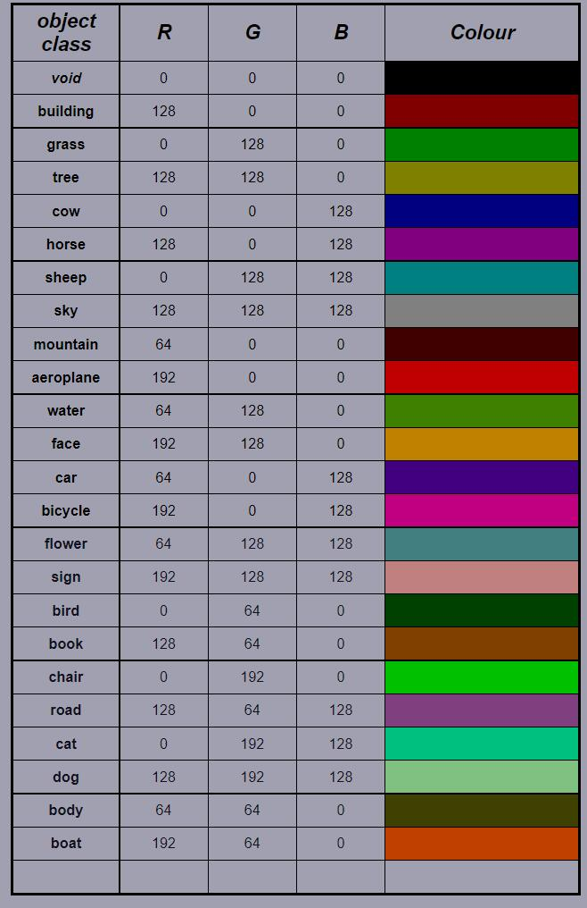
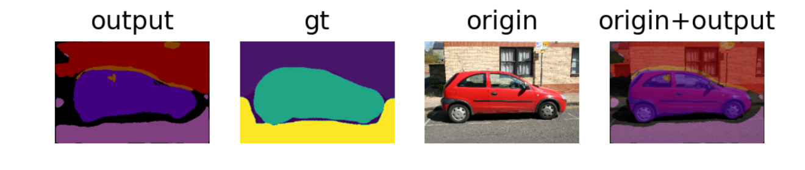
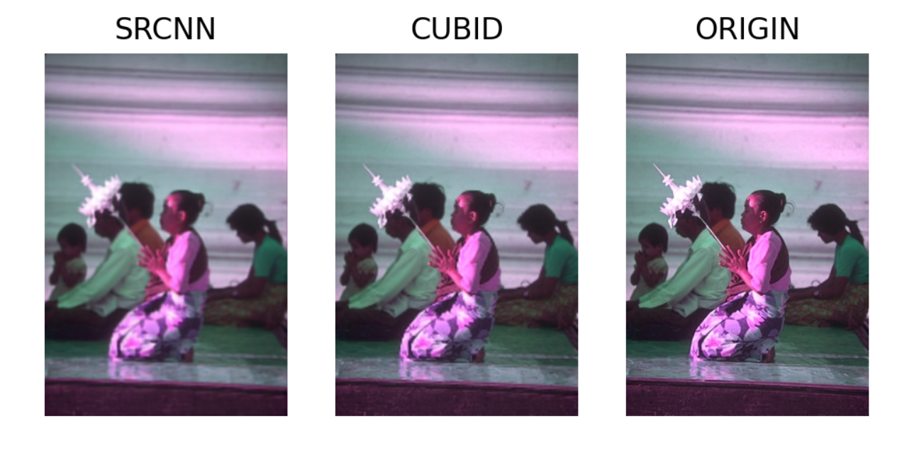

# Work2

- Unet For MSCV-V2 Segmentation Dataset 
- SRCNN for BSDS 500 super-resolution Dataset

## Brief

------
This project is aiming to use `Unet` to finish segmentation task of `MSRC-V2` Dataset.

And use `SRCNN` to finish super resolution task of `BSDC500` Dataset.

## Dataset

----

[Download](https://www.microsoft.com/en-us/research/project/image-understanding/)

> 用百度云盘下载：实验2-图像分割-超分-数据集.txt

----
### MSRC v2
The MSRC v2 dataset is an extension of the MSRC v1 dataset from Microsoft Research in Cambridge. 

It contains `591 images` and `23 object classes` with accurate pixel-wise labeled images. 

Though it contains 23 object classes, only `21 classes are commonly used`. 
The unused labels are (void==0, horse==5, mountain==8) due to background or too few training samples. 

---

### BSDC 500
The dataset is divided into three parts: 200 for training, 100 for validation and the rest 200 for test.
> we combine the training data and validation data for training
---
- Dataset
  - msrc2_seg
    - gt: ground_truth `[channels=3]`
    - gt_label: ground_truth label with `22 classes including background` `[channels=2]`
    - images
    - Test.txt: the annotation file of test img
    - Train.txt: the annotation file of train img
    - Validation.txt: the annotation file of  img
    - Colormap
  

  - bsds500
    - test
    - trainval

## Main File

---

- Unet_for_MSRCv2.ipynb

  Some details and tutorial information had already been recorded.

- ground_truth_encoding.ipynb

  Turn `ground_truth` to `ground_truth_label` 

- SRCNN_for_BSDS500.ipynb

  Some details and tutorial information had already been recorded.

## Requirements

---

- torch
- torchvision
- glob
- cv2
- PIL
- numpy
- matplotlib
- tqdm
- pandas

## Result

---

- Unet_for_MSRCv2

- SRCNN_for_BSDS500

